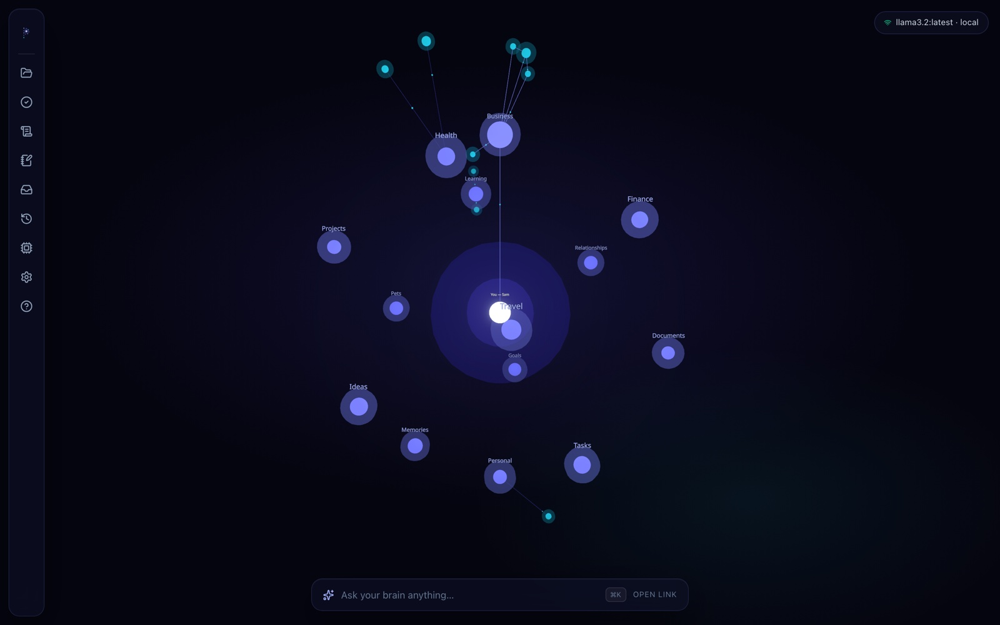
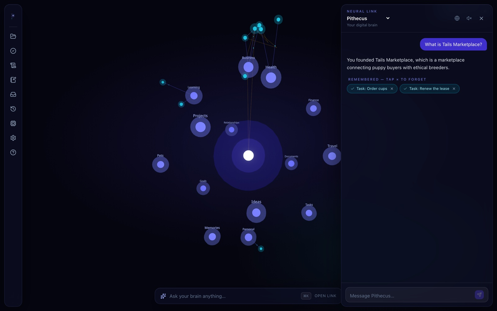
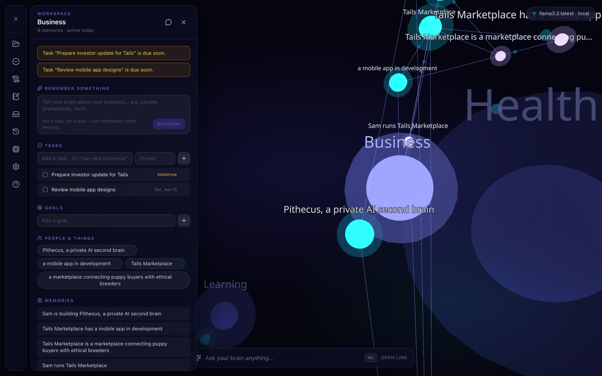
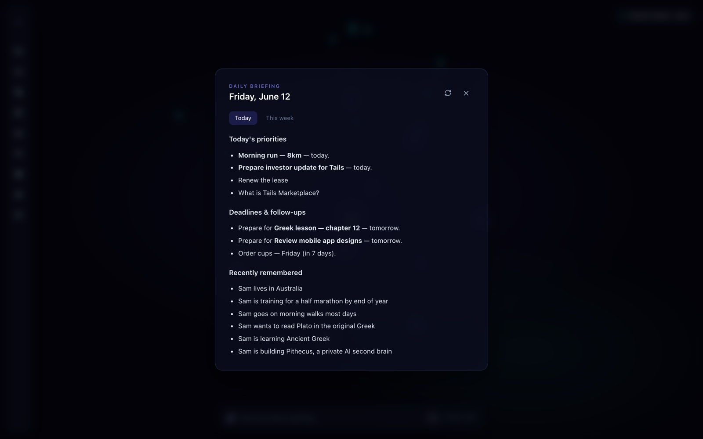

  

<h1 align="center">Pithecus — Your Private AI Brain</h1>

  Everything you know, everyone you care about, every goal you're working toward — 
  remembered, connected, and always available. <strong>Entirely on your machine.</strong>

  <a href="https://pithecus.com.au"><strong>→ Get Pithecus at pithecus.com.au</strong></a>

  
  
  
  

---

## What is Pithecus?

Pithecus is a **local-first AI second brain** for Mac and PC. It learns from every conversation — building a private knowledge graph of your life, work, relationships, and goals — and uses that context to think *with* you, not just at you.

**No cloud. No accounts. No data ever leaving your computer.**

---

## See it think

<em>Watch memory become action — a brain builds itself, lights up while answering, and stays private the whole time.</em>

<table>
  <tr>
    <td></td>
    <td></td>
  </tr>
  <tr>
    <td align="center"><em>Your life as a living neural map</em></td>
    <td align="center"><em>Ask anything — watch it recall in real time</em></td>
  </tr>
  <tr>
    <td></td>
    <td></td>
  </tr>
  <tr>
    <td align="center"><em>Workspaces keep every part of life separate</em></td>
    <td align="center"><em>A daily briefing that knows your deadlines</em></td>
  </tr>
</table>

---

## Features

- **Persistent memory** — remembers people, businesses, projects, health, goals, and relationships across every conversation
- **Knowledge graph** — facts stored as a visual 3D brain that grows as you talk
- **Agentic Intelligence** — proposes plans, drafts tasks, and summarises your week — all requiring your explicit approval
- **Workspace Momentum Score** — a live 0–100 score showing traction across your active workspaces
- **Wake-up Intelligence** — smart summary of what changed while you were away, with actionable suggestions
- **Menu bar companion** — always-available Mac/PC system tray app for instant capture
- **Global hotkey** — capture a thought from anywhere on your system instantly
- **Daily briefing** — morning summary of your tasks, goals, and priorities
- **100% offline** — powered by [Ollama](https://ollama.com) running local models (Llama 3, Mistral, Gemma, and more)
- **Multi-workspace** — separate brains for different areas of your life

---

## Download

| Platform | |
|---|---|
| **Mac** | [pithecus.com.au](https://pithecus.com.au) |
| **Windows** | [pithecus.com.au](https://pithecus.com.au) |

---

## Requirements

**Mac** — macOS 12+, [Ollama](https://ollama.com/download), 8GB+ RAM

**Windows** — Windows 10/11, [Ollama](https://ollama.com/download), Python 3.10+, 8GB+ RAM

---

## Built by

**Sam Bousounis** — [pithecus.com.au](https://pithecus.com.au)

---

*Pithecus is proprietary software. All rights reserved.*
